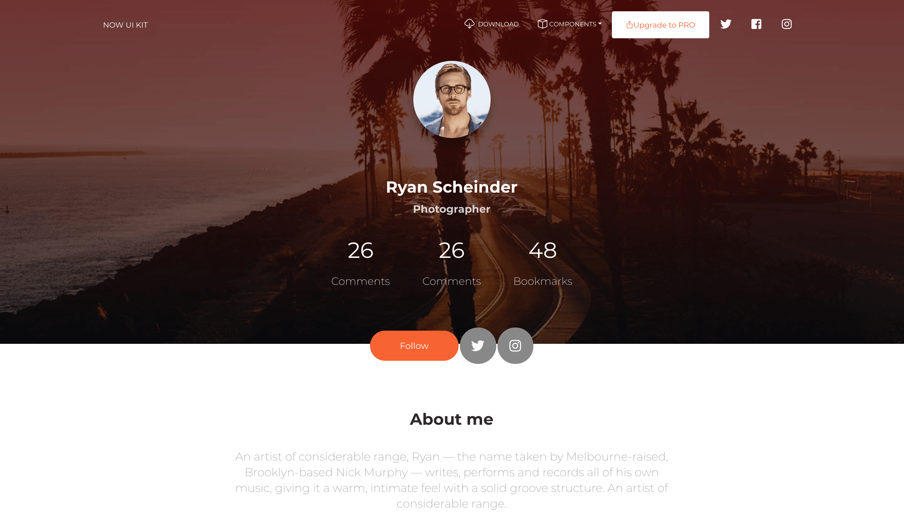
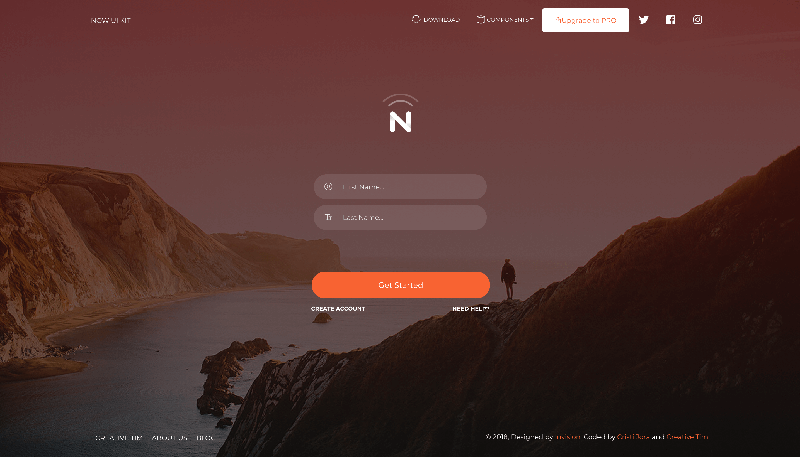

## Vue template

**[Vue Now UI Kit](http://demos.creative-tim.com/vue-now-ui-kit)** is a responsive Bootstrap 4 kit provided for free by Invision and Creative Tim. It is a beautiful cross-platform UI kit featuring over 50 elements and 3 templates.

Vue Now UI Kit is one of the most popular UI Kits online, provided in PSD and Sketch formats by Invision. We wanted to find a way for developers worldwide to benefit from using it. So, in collaboration with Invision, we are launching the HTML version for it!

Now will help you create a clean and simple website that is a perfect fit for today's flat design. It is built using the 12 column grid system, with components designed to fit together perfectly. It makes use of bold colours, beautiful typography, clear photography and spacious arrangements.

Create awesome, lifelike prototypes with InVision and Now so your users can experience and give feedback on your vision!

To get the PSD and Sketch files, please visit Invision (https://www.invisionapp.com/now).

Technologies used: 
[Vue.js (2.5)](https://vuejs.org/) as framework for development.
[Vue CLI 3](https://github.com/vuejs/vue-cli) for project scaffolding.
[Vue Router](https://router.vuejs.org/) for handling routes.
[Bootstrap 4](https://getbootstrap.com/docs/4.0/getting-started/introduction/) as a general css foundation.
[Element UI](http://element.eleme.io/#/en-US/component/installation) for some complex js components such as tooltips, datepickers, popovers.

We are very excited to share this ui kit with you and we look forward to hearing your feedback!

You can find the Github Repo here.

## Table of Contents

* [Versions](#versions)
* [Demo](#demo)
* [Quick Start](#quick-start)
* [Documentation](#documentation)
* [File Structure](#file-structure)
* [Browser Support](#browser-support)
* [Resources](#resources)
* [Reporting Issues](#reporting-issues)
* [Technical Support or Questions](#technical-support-or-questions)
* [Licensing](#licensing)
* [Useful Links](#useful-links)


## Versions

[](https://www.creative-tim.com/product/now-ui-kit)
[](https://www.creative-tim.com/product/vue-now-ui-kit)
[](https://www.creative-tim.com/product/now-ui-kit-angular)


| HTML | Vue | Angular |
| --- | --- | --- |
| [](https://www.creative-tim.com/product/now-ui-kit) | [](https://www.creative-tim.com/product/vue-now-ui-kit) | [](https://www.creative-tim.com/product/now-ui-kit-angular)

## Demo

| Components | Landing | Profile | Login |
| --- | --- | --- | --- |
| [](https://demos.creative-tim.com/vue-now-ui-kit/#/) | [](https://demos.creative-tim.com/vue-now-ui-kit/#/landing) | [](https://demos.creative-tim.com/vue-now-ui-kit/#/profile) | [](https://demos.creative-tim.com/vue-now-ui-kit/#/login)

[View More](https://demos.creative-tim.com/vue-now-ui-kit).


## Quick start

Quick start options:

- Clone the repo: `git clone https://github.com/mikhalkevich/Vue_template.git`.
- Run `npm install` or `yarn install`
- Run `npm run serve` to start a local development server


## Documentation
The documentation for Vue Now UI Kit is hosted at our [website](https://demos.creative-tim.com/vue-now-ui-kit/documentation/).


## File Structure

Within the download you'll find the following directories and files:

```
Vue Now Ui Kit
|-- src
        |-- App.vue
        |-- main.js
        |-- router.js
        |-- assets
        |   |-- fonts
        |   |-- scss
        |-- components
        |-- directives
        |-- layout
        |-- pages
        |-- plugins
```

## Resources
- Demo: https://demos.creative-tim.com/vue-now-ui-kit
- Download Page: https://www.creative-tim.com/product/vue-now-ui-kit
- Documentation: https://demos.creative-tim.com/vue-now-ui-kit/documentation/
- License Agreement: https://www.creative-tim.com/license
- Support: https://www.creative-tim.com/contact-us
- Issues: [Github Issues Page](https://github.com/creativetimofficial/vue-now-ui-kit/issues)
- [Vue Now UI Dashboard PRO - For Dashboard development](https://www.creative-tim.com/product/vue-now-ui-dashboard-pro?ref=github-vue-nud-free)


## Licensing

- Copyright 2018 Creative Tim (https://www.creative-tim.com)
- Licensed under MIT (https://github.com/creativetimofficial/vue-now-ui-kit/blob/master/LICENSE.md)

## Useful Links

More products from Creative Tim: <https://www.creative-tim.com/products>

Tutorials: <https://www.youtube.com/channel/UCVyTG4sCw-rOvB9oHkzZD1w>

Freebies: <https://www.creative-tim.com/products>

Affiliate Program (earn money): <https://www.creative-tim.com/affiliates/new>

